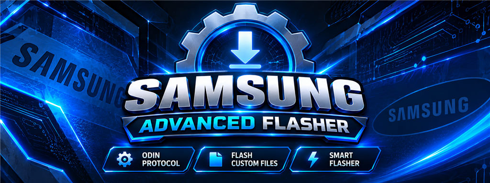
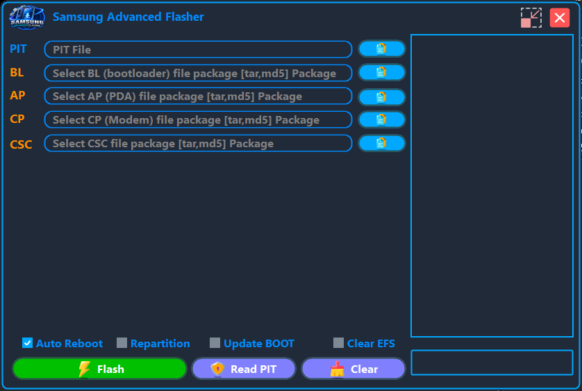
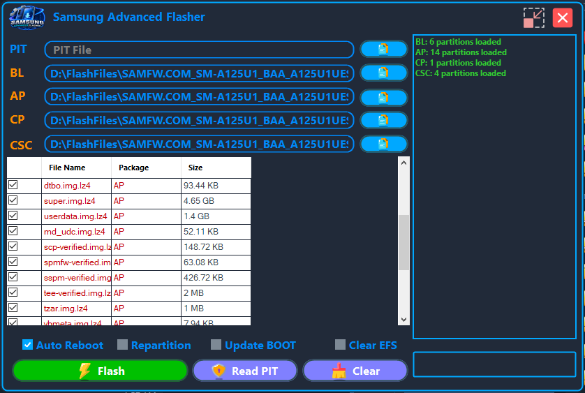

<div align="center">



# 🔥 Sharp Odin Protocol By Anas — Samsung Advanced Flasher

**A modern Windows flasher for Samsung Galaxy devices — built on the Odin download-mode protocol**

[](LICENSE)


**👑 Crafted by Anas Malik** — *AMProTeam*

</div>

---

## 🌍 About

The closest experience to the stock tool, wrapped in a sleek dark theme. Load your firmware
bundles (**BL / AP / CP / CSC**), pick or read a **PIT** file straight from the device, then
flash **LZ4-compressed** partitions with a live color-coded console and a per-file progress bar —
all from a polished **Guna.UI2** desktop interface.

> ⚠️ **Warning:** Flashing wrong firmware can **permanently damage** your device (brick).
> You are solely responsible for what you do with this tool. See
> [Safety & Disclaimer](#-safety--disclaimer) before using.

---

## ✨ Features

- 📦 **Load firmware packages** — BL (bootloader), AP (PDA/Android), CP (modem/baseband), CSC (country-specific) as `.tar`, `.md5`, or `.limra` bundles.
- 🗺️ **PIT support** — select a `.pit` file from disk, or let the app find and validate one hidden inside a TAR package.
- 📖 **Read PIT from device** — pull the live partition table off your phone and save it.
- ⚡ **LZ4 partition detection** — parses TAR contents, detects `.lz4` blobs, and computes their real uncompressed sizes.
- 🛠️ **Flash options** — Repartition, Update BOOT, Clear EFS, Auto Reboot.
- 🖥️ **Live console** — color-coded log of every protocol step, with a per-file progress bar.
- 🎨 **Dark modern UI** — frameless window, rounded corners, Guna.UI2 controls.
- 🛡️ **EFS safety guard** — a warning dialog before any operation that clears EFS.
- ✅ **Interactive partition grid** — every partition is pre-checked; uncheck anything you don't want to flash.

---

## 📸 Screenshots





---

## 🧩 Requirements

- **Windows 7 / 8 / 8.1 / 10 / 11**
- **[.NET Framework 4.8](https://dotnet.microsoft.com/download/dotnet-framework/net48)** (or newer)
- A Samsung device in **Download Mode** with the USB cable connected:
  - Older devices: `Volume Down + Home + Power`
  - Newer devices: `Volume Down + Volume Up + USB connect`
- A firmware package that exactly matches your device model and region

---

## 🛠️ Building from source

1. Open `Sharp Odin Protocol By Anas.slnx` in **Visual Studio 2022 (17.10+)**.
2. NuGet packages are restored automatically on build.
3. Build the solution in **Release** mode.

> The project also supports legacy `packages.config` restore, so older tooling still works.
> The manifest (`app.manifest`) requests **administrator** rights — required to talk to the
> device driver during flashing.

---

## 🚀 Usage

| Step | Description |
|---|---|
| 1 | Launch the app (it must run as administrator). |
| 2 | Put your device in **Download Mode** and connect it. |
| 3 | Load your firmware packages: **BL** → bootloader · **AP** → Android/PDA · **CP** → modem · **CSC** → country-specific. |
| 4 | Every partition appears in the grid, pre-checked. Uncheck any you don't want to flash. |
| 5 | Optional: **Select PIT** (needed for repartitioning) or **Read PIT** to save the current table. |
| 6 | Choose flash options: **Auto Reboot**, **Repartition** (requires a PIT file), **Update BOOT**, **Clear EFS** ⚠️. |
| 7 | Press **Flash** and wait — the console shows each protocol step and the final OK/Failed result. |

---

## 🗂️ Project structure

```
├── Controllers/
│   └── FlashController.cs        UI orchestration between view and services
├── Services/
│   ├── FirmwarePackageService.cs PIT selection + TAR package opening
│   ├── FirmwareRepository.cs     In-memory store of loaded partitions
│   ├── FlashSession.cs           Facade wiring flash + PIT managers
│   ├── FlashOptions.cs           Flash configuration DTO
│   └── PitSelectionResult.cs     PIT selection outcome
├── odin/
│   ├── FlashManager.cs           Core flashing workflow (SharpOdinClient wrapper)
│   ├── PitManager.cs             Read-PIT-from-device workflow
│   ├── TarPartitionReader.cs     TAR/LZ4 parsing + PIT extraction/validation
│   └── FlashFileItem.cs          Partition model
├── UI/
│   ├── FlashView.cs              View-model binding over the form controls
│   ├── LogConsole.cs             Thread-safe console logging
│   ├── PartitionGridView.cs      DataGridView binding + row coloring
│   ├── ProgressIndicator.cs      Progress bar updates
│   ├── FlashControlsState.cs     Button/control enable-state manager
│   ├── UiDispatcher.cs           Cross-thread UI marshaling
│   ├── UserPrompts.cs            Dialogs (PIT, EFS warnings)
│   └── WindowChromeHelper.cs     Frameless window dragging
├── Form1.cs / Form1.Designer.cs  Main window (Guna.UI2)
└── Program.cs                    Entry point
```

A clean layered design: **Form (View) → FlashController → Services → Odin layer**, with the
low-level protocol handling delegated to the `SharpOdinClient` library.

---

## 📦 NuGet dependencies

| Package | Purpose |
|---|---|
| [Guna.UI2.WinForms](https://www.nuget.org/packages/Guna.UI2.WinForms) 2.0.4.8 | Modern UI controls |
| [SharpOdinClient](https://www.nuget.org/packages/SharpOdinClient) 1.0.2 | Odin protocol engine |
| K4os.Compression.LZ4 (+ Legacy, Streams) | LZ4 decompression of firmware blobs |
| K4os.Hash.xxHash | Hash verification while parsing TARs |

---

## ⚠️ Compatibility notes

- Firmware packages must match your exact device model and region — flashing the wrong files can **brick** the device.
- Some models (e.g. US-carrier or newer devices) may need additional steps not covered here.
- This is an independent implementation of the Odin protocol based on the open-source `SharpOdinClient`; it is **not affiliated with or endorsed by Samsung Electronics**.

---

## 🛡️ Safety & Disclaimer

- **Use at your own risk.** Wrong firmware, interrupted flashing, or clearing EFS can permanently damage your device, erase your IMEI, or void your warranty.
- Always keep a **full EFS backup** before any operation that touches EFS.
- Do **not** unplug the device during flashing.
- The author assumes no responsibility for any damage caused by the use of this tool.

---

## 📜 License

This project is licensed under the **MIT License** — see the [LICENSE](LICENSE) file.
Note that third-party components (Guna.UI2, SharpOdinClient, K4os libraries) are subject to their own licenses.

---

## 🙌 Connect with me

| Platform | Link |
|---|---|
|  | [t.me/v6f_z](https://t.me/v6f_z) |
|  | [instagram.com/v6f_z](https://instagram.com/v6f_z) |
|  | [facebook.com/anasmalikdev](https://facebook.com/anasmalikdev) |
|  | [github.com/v6f-z](https://github.com/v6f-z) |
|  | [anasmalikopop@gmail.com](mailto:anasmalikopop@gmail.com) |

**AMProTeam** — *Anas Malik*

---

<div align="center">

**Support the project with a star ⭐**

</div>
